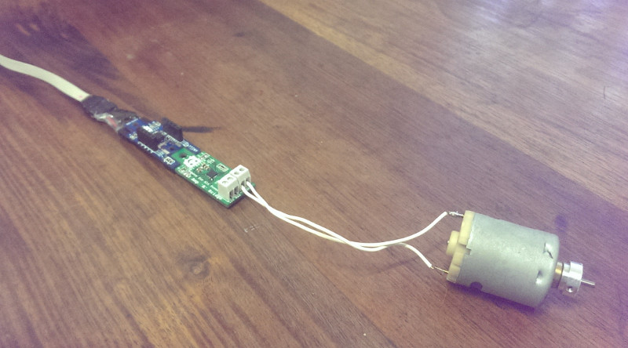

Controlling an H-Bridge Driver via Serial
-----------------------------------------

An H-Bridge is an electronic circuit that enables a voltage to be applied 
to DC-Motor in a way that enables it to run in either direction. These 
circuits are often used in robotics, consumer devices, automotive and 
other applications.

Controlling a motor through an H-Bridge is done with two pins. There is
a forward and a reverse pin. To make the motor run forward involves
applying a Logic 1/High to the forward pin and a logic 0/Low to the
reverse pin.

    pin_fwd.setval(1);

When run, this code will cause the motor to run forward.

With the clixx.io framework, it's very easy to add external control to
this example by adding the Serial object. This will enable us to process
a line of text at a time and allow external serial control of the 
micro-controller.

    Serial.begin();
    Serial.puts("\r\nH-Bridge Motor Controller\r\n");
    Serial.puts("Commands are: 'f'=Forward,'r'=Reverse,'0'=Off\r\n");
    Serial.echo = 1

This will inform users of the commands that we wish to implement.

Before starting we also need to initialise the GPIO ports both with
forward and reverse pins set for output.

    pin_fwd.configure(PB4,OUTPUT);
    pin_rvs.configure(PB3,OUTPUT);

The next step is to modify the serialline() callback so that it
can react to the short one character commands.

We will be supporting 'f', 'r', '0' as simple one character commands
to make the motor move Forward, in Reverse, and Off respectively.

    void serialline(){
        /* SerialLine Event handler
        This gets called when a line is received.
        */
        char *cptr = (char *) Serial.lastline();
        char c = *cptr;
        if (c == 'f')
        {
            Serial.puts("Forward\r\n");
            pin_fwd.setval(1);
            pin_rvs.setval(0);
        }
        else if (c == 'r')
        {
            Serial.puts("Reverse\r\n");
            pin_fwd.setval(0);
            pin_rvs.setval(1);
        }
        else if (c == '0')
        {
            Serial.puts("Turned Off\r\n");
            pin_fwd.setval(0);
            pin_rvs.setval(0);
        }
        else
        {
            Serial.puts("Command not understood. 'f'=Forward,'r'=Reverse,'0'=Off\r\n");
        }
    };

With our Makefile now complete, all we need to do is to upload that to
our Attiny85.

    make && make deploy
    
Then finally, we can log into our Attiny85 through the serial port using
a common terminal program.

    >screen /dev/ttyUSB0 9600
    H-Bridge Motor Controller
    Commands are: 'f'=Forward,'r'=Reverse,'0'=Off
    f
    Forward
    0
    Turned Off
    r
    Reverse
    0
    Turned Off

